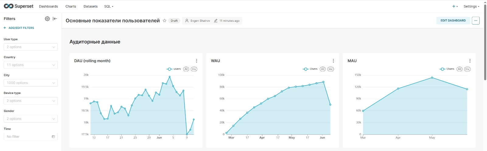
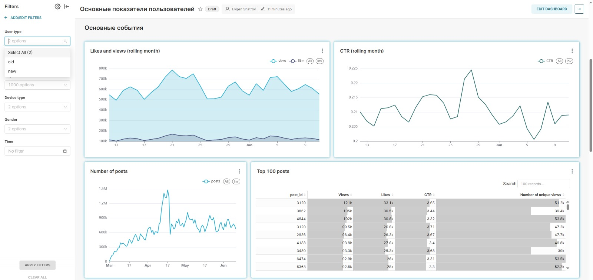
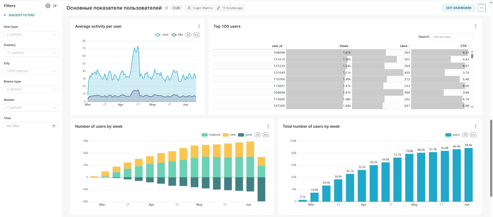
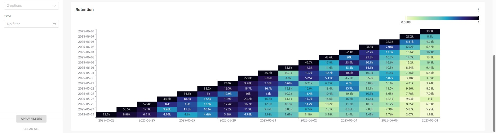

# Superset Dashboard: Аналитика пользовательской активности

Этот репозиторий содержит проект Superset с построенными графиками для анализа пользовательской активности и взаимодействия с приложением.

---

## 📊 Основные метрики и графики на дашборде

- DAU, MAU, WAU — ежедневные, месячные и недельные активные пользователи  
- Likes и Views (плавающий месяц)  
- CTR (плавающий месяц)  
- Количество публикаций  
- Топ-100 постов по активности  
- Средняя активность на пользователя  
- Топ-100 пользователей  
- Количество пользователей по неделям в разбивке на новых, оставшихся и выбывших
- Общее количество пользователей по неделям  
- Retention — удержание пользователей  

Для удобства использования на дашборде настроены фильтры по времени и другим параметрам. Некоторые графики строятся на базе кастомных SQL-запросов.

---

## 📸 Графики









## 🔍 Используемые SQL-запросы

Ниже приведены примеры сложных SQL-запросов, которые используются в дашборде для получения ключевых метрик и построения графиков.

### 1. Подсчет активных пользователей по дате и дате первого действия

```sql
SELECT toString(date) as date, toString(start_date) as start_date, count(user_id) as active_users
FROM
(
  SELECT user_id, min(toDate(time)) as start_date 
  FROM simulator_20250420.feed_actions 
  GROUP BY user_id
  HAVING start_date >= today()-20
) t1
JOIN
(
  SELECT user_id, toDate(time) as date
  FROM simulator_20250420.feed_actions
) t2
USING user_id
GROUP BY date, start_date
```
### 2. Расширенный выбор данных с вычислением новых и старых пользователей, а также пола

```sql
SELECT t2.user_id as user_id, t2.post_id, t2.action, t2.time, t2.age, t2.country, t2.city, t2.os, t2.source, t2.exp_group, t1.start_date as start_date,
if(start_date = toDate(time), 'new', 'old') as new,
if(t2.gender = 1, 'male', 'female') as gender
FROM
(SELECT user_id, min(toDate(time)) as start_date 
FROM simulator_20250420.feed_actions 
GROUP BY user_id) t1
JOIN
(SELECT * FROM simulator_20250420.feed_actions) t2
ON t1.user_id = t2.user_id
```
### 3. Определение пользователей со статусами "новый", "удержанный" и "выбывший" по неделям

```sql
SELECT 
    this_week, 
    previous_week, 
    -uniq(user_id) AS num_users, 
    status 
FROM (
    SELECT 
        user_id,
        groupUniqArray(toMonday(toDate(time))) AS weeks_visited,
        addWeeks(arrayJoin(weeks_visited), +1) AS this_week,
        IF(has(weeks_visited, this_week) = 1, 'retained', 'gone') AS status,
        addWeeks(this_week, -1) AS previous_week
    FROM simulator_20250420.feed_actions
    GROUP BY user_id
)
WHERE status = 'gone'
GROUP BY this_week, previous_week, status
HAVING this_week != addWeeks(toMonday(today()), +1)

UNION ALL

SELECT 
    this_week, 
    previous_week, 
    toInt64(uniq(user_id)) AS num_users, 
    status 
FROM (
    SELECT 
        user_id,
        groupUniqArray(toMonday(toDate(time))) AS weeks_visited,
        arrayJoin(weeks_visited) AS this_week,
        IF(has(weeks_visited, addWeeks(this_week, -1)) = 1, 'retained', 'new') AS status,
        addWeeks(this_week, -1) AS previous_week
    FROM simulator_20250420.feed_actions
    GROUP BY user_id
)
GROUP BY this_week, previous_week, status
```
